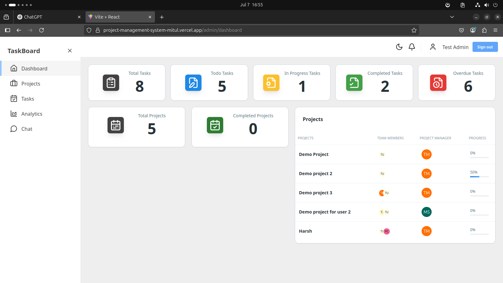
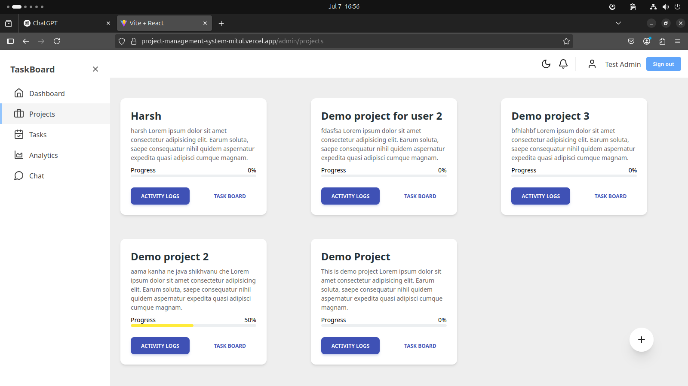
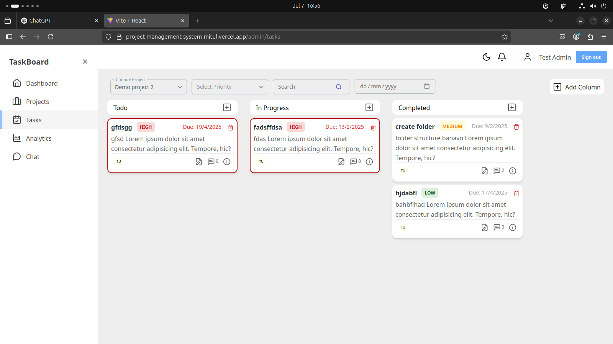
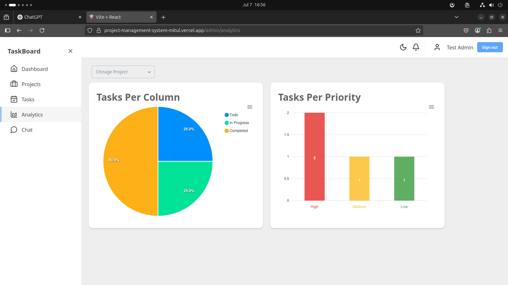
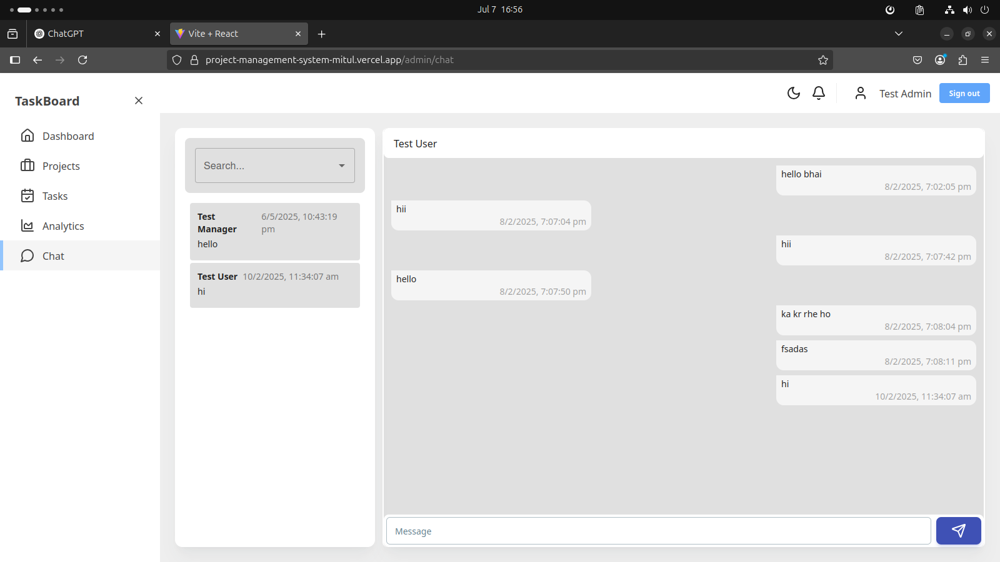

# 📋 Project Management System

A full-featured, real-time project management and collaboration platform.  
It helps teams manage projects, tasks, and communication efficiently with a modern UI and role-based access.

🌟 Open for open-source contributions!

## 🚀 Features

✅ **Dashboard** — Overview of tasks, projects, and their statuses.  
✅ **Projects** — Create and manage projects and assign team members.  
✅ **Kanban Task Board** — Drag-and-drop tasks across columns (ToDo, In Progress, Completed).  
✅ **Analytics** — Visualize task and project progress (Admin only).  
✅ **Real-Time Chat** — One-to-one chat between users.  
✅ **Real-Time Notifications** — Instant updates on task and project changes.

## 📸 Screenshots

| Dashboard                        | Projects                        | Kanban Board                  |
| -------------------------------- | ------------------------------- | ----------------------------- |
|  |  |  |

| Analytics                        | Chat                        |
| -------------------------------- | --------------------------- |
|  |  |

## 👥 Roles & Permissions

There are **three roles** with different capabilities:

| Role                | Permissions                                                                                                  |
| ------------------- | ------------------------------------------------------------------------------------------------------------ |
| **Admin**           | 🔹 Full control: create projects, assign team members, assign managers, see analytics, all tasks/projects    |
| **Project Manager** | 🔹 Manage only their projects. Can create and delete any task within their projects.                         |
| **User**            | 🔹 View projects they’re part of. Can create tasks (assigned to themselves) and delete only their own tasks. |

- When a user is assigned as a manager to a project, their role is automatically promoted to **Project Manager**.
- Analytics and notifications are currently accessible only to **Admin**.

## 🛠️ Tech Stack

- **Frontend**: React + Vite
- **State Management**: Redux Toolkit
- **UI & Styling**: Material Tailwind, TailwindCSS
- **Backend**: Node.js + Express.js
- **Database**: MongoDB
- **Authentication**: JWT-based with Role-Based Access Control
- **Real-time**: Socket.IO

---

## 🔑 Dummy Credentials

You can use the following dummy accounts to try the deployed app:

| Role                | Email                       | Password     |
| ------------------- | --------------------------- | -----------  |
| **Admin**           | `admin@gmail.com`        | `Admin@1234`   |
| **Project Manager** | `manager@gmail.com`      | `Manager@1234` |
| **User**            | `user@gmail.com`         | `User@1234`    |

Visit the deployed app here:  
👉 [Live Demo](https://project-management-system-mitul.vercel.app/)

---
